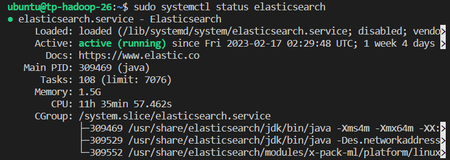
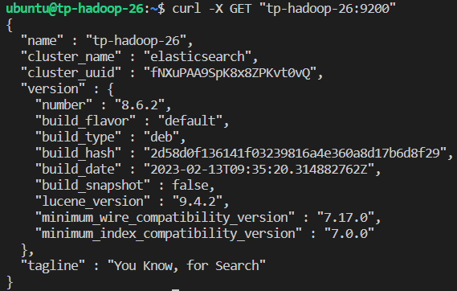
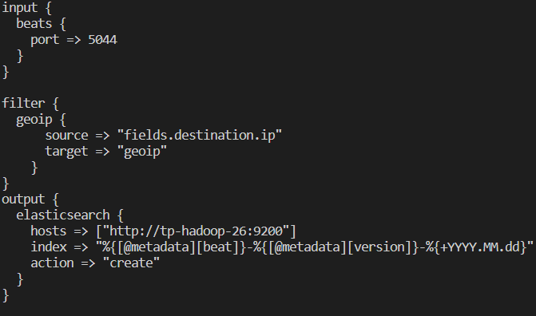
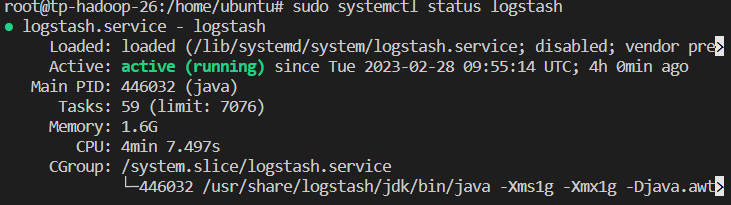
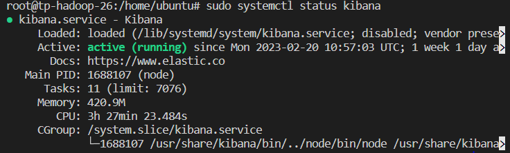
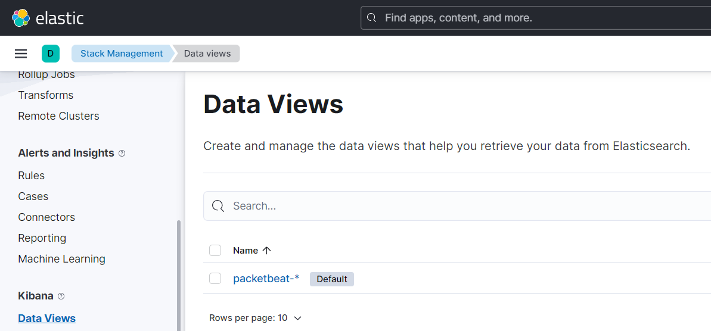
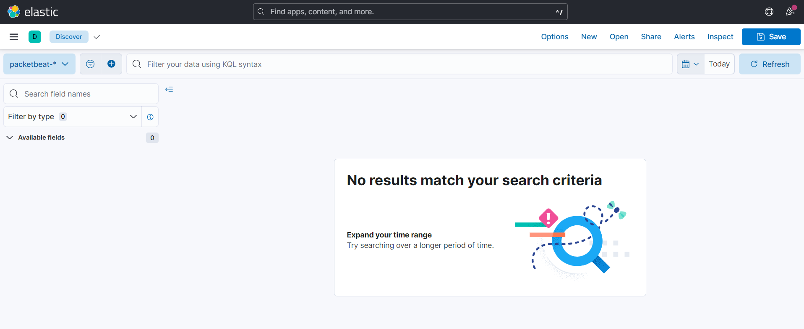
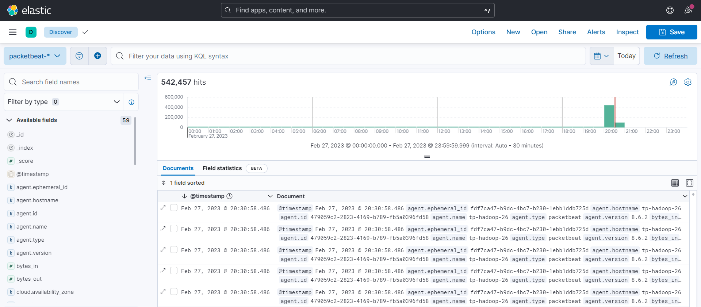
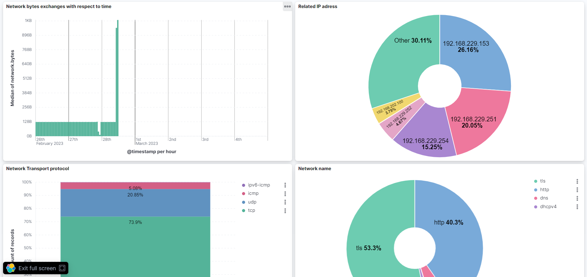

# Installation de la stack ELK

---

---

La stack ELK est composée de 3 logiciels : Elasticsearch, Logstash et Kibana. Dans ce projet, nous documentons un cas d’usage de la stack ELK pour l’analyse de paquet réseau.

## Elasticsearch

---

Elasticsearch est un moteur de recherche basé sur la bibliothèque Lucene qui fournit un moteur de plein texte distribué avec une interface web HTTP et des documents JSON. Il stocke des évènements provenant de Logstash ou d’autres framework comme Packetbeat et offre la possibilité d’y effectuer des recherches en temps réel. Elasticsearch tourne par défaut sur le port 9200

## Logstash

---

Logstash est un framework de traitement des données. Il permet de collecter, de transformer et de charger les données dans Elasticsearch. Par défaut, Logstash tourne sur le port 5044.

## Kibana

---

Kibana est un interface de visualisation des données par l’intermediaire des dashboards.

## Infrastructure

---

Dans ce projet, nous installons la stack ELK sur des ordinateurs distants de Telecom. La machine virtuelle utilisée est a les caractéristiques suivante : 

RAM : 6GB

Disque dur : 38 GB

## Installation de Elasticsearch

---

Il est nécessaire, avant de commencer l’installation de la stack ELK de vérifier que java est à jour sur le terminal utilisé. Pour cela, il est possible d’utiliser les commandes suivantes:

```bash
sudo apt update
sudo apt install nano default-jdk
```

Une fois que Java est installé, on peut procédé à l’installation de Elasticsearch. On choisit pour ce projet la version 8. Plusieurs sources d’installation sont disponible en ligne. Les sources utilisés sont cité en fin de ce rapport. Les commandes ci-dessous permettent de télécharger la clé publique Elastic, et de sauvegardé le repositorie de la stack dans le dossier spécifié.

```bash
wget -qO - https://artifacts.elastic.co/GPG-KEY-elasticsearch | sudo gpg --dearmor -o /usr/share/keyrings/elasticsearch-keyring.gpg
echo "deb [signed-by=/usr/share/keyrings/elasticsearch-keyring.gpg] https://artifacts.elastic.co/packages/8.x/apt stable main" | sudo tee /etc/apt/sources.list.d/elastic-8.x.list
```

Une fois que cela est fait, on peut installer Elasticsearch à l’aide de la commande ci-dessous :

```bash
sudo apt-get update && sudo apt-get install elasticsearch
```

On définit les réglages de base d’Elasticsearch dans le fichier de configuration, disponible à l’adresse ci-dessous :

```bash
sudo nano /etc/elasticsearch/elasticsearch.yml
```

il est important de définir l’ip public sur laquelle sera lancé Elasticsearch de facon à pouvoir y accéder depuis l’extérieur, car la machine virtuelle utilisée est dans un réseau privé. Pour cela, on modifie le paramètre ci-dessous dans le fichier de configuration.

```bash
network.host: tp-hadoop-26 # Sachant que tp-hadoop-26 correspond à l'adresse ip publique de la machine
```

Une fois que la configuration du fichier `.yml` est terminé, on peut lancer et vérifier le bon fonctionnement de Elasticsearch, en exécutant les commandes ci-dessous : 

```bash
sudo systemctl start elasticsearch
sudo systemctl enable elasticsearch
sudo systemctl status elasticsearch
On peut également vérifier que les requêtes vers Elasticsearch fonctionnent en utilisant la commande curl comme présenté ci-bas : 
```



```bash
curl -X GET "tp-hadoop-26:9200"
```



## Installation de Logstash

---

Elasticsearch étant installé, on installe à présent Logstash

```bash
sudo apt install logstash
```

Ensuite on paramètre Logstash pour qu’il puisse répondre à notre besoin, qui est de traité les beats (paquets réseaux) et de les envoyer dans Elasticsearch

```bash
sudo nano /etc/logstash/conf.d/beats.conf
```



Dans la section `input`, on spécifie l’origine des données. Dans notre cas, ces données proviennent de packetbeat qui est défini plus tard dans ce rapport.

La section `filter` contient les différentes opérations de traitement des données. Ici on réalise un parsing du champs contenant les ip, mais malheureusement cela n’a pas été un succès car le champ contenant les ip est complexe et les adresses contenu dans ce champ ne sont pas pris comme des valeurs.

La section `output` contient l’indication du stockage des données traitées. Ici, les données sont directement injectées dans Elasticsearch.

On peut également vérifier le bon fonctionnement de Logstash en appliquant les commandes ci-dessous :

```bash
sudo systemctl start logstash
sudo systemctl enable logstash
sudo systemctl status logstash
```



## Installation de Kibana

---

On termine l’installation de la stack ELK par le framework de visualisation Kibana. L’installation de Kibana se fait avec la commande ci-dessous :

```bash
sudo apt install kibana
```

Ensuite, on édite le fichier de configure :

```bash
sudo nano /etc/kibana/kibana.yml
```

Les paramètres important sont les suivant :

```bash
server.host: "0.0.0.0"  # Pour autoriser les connexion entrant de n'importe quelle ip
elasticsearch.hosts: ["http://tp-hadoop-26:9200"]  # Pour permettre à Kibana de se connecter au serveur Elasticsearch
```

Enfin on peut lancer et vérifier le bon fonctionnement de Kibana

```bash
sudo systemctl start kibana
sudo systemctl enable kibana
sudo systemctl status kibana
```



En se connectant au navigateur, on peut observé l’écran d’accueil ci-dessous, qui confirme également le bon état des service et de la stack ELK


## PacketBeat

---

Maintenant que notre stack ELK est installée, nous allons procédé à la configuration de Packetbeat, qui nous permettra ainsi de collecter des données que nous pourront visualiser dans kibana.

PacketBeat est un framework de lecture de paquets réseau, qui permet de récolter et de transmettre une grande partie des évènements réseau vers Logstash ou Elasticsearch

Pour ce projet, nous aurons besoin d’avoir un Elasticsearch, un logstash et un kibana qui fonctionne correctemement. 

Pour la plus part des platformes, Packetbeat à besoin de la librairie de capture de packet libpcap (librairy packet capture). cette librairie s’installe de la façon suivante :

```scala
sudo apt-get install libpcap0.8
```

Sur linux, il n’est souvent pas nécessaire de l’installer, car très souvent elle est déjà installé. Si tel est le cas, vous aurez la notification.

Pour installer Packetbeat, nous exécutons les commandes suivantes : 

```bash
curl -L -O https://artifacts.elastic.co/downloads/beats/packetbeat/packetbeat-8.6.2-amd64.deb
sudo dpkg -i packetbeat-8.6.2-amd64.deb
```

Une fois l’installation terminée, nous devons configurer Packetbeat, pour qu’il s’interface correctement avec Elasticsearch et Kibana. La configuration est faite dans le fichier `packetbeat.yml`. Par défaut, le fichier se trouve dans `/etc/packetbeat`. On configure dans ce fichier vers quel outil on souhaite pousser les évènement réseaux recueillis par Packetbeat (soit directement dans Elasticsearch, soit d’abord dans logstash). On peut également préciser les noms d’utilisateur et mot de passe, mais pour le moment on se contente de faire une PoC.

```bash
output.elasticsearch:
	hosts: ["http://tp-hadoop-26:9200"]

# ou 

output.logstash:
	hosts: ["tp-hadoop-26:5044"]
```

Etant donné que notre finalité est de faire une visualisation sur Kibana, on renseigne également dans le fichier de configuration les informations de connexion vers le serveur Kibana

```bash
setup.kibana:
    host: "tp-hadoop-26:5601"
```

Nous laissons volontaire les informations de par défaut sur les port et protocole à partir des quels le trafic sera capturé et analysé par Packetbeat. Ces port et service sont par exemple ceux listé ci dessous : 

```bash
packetbeat.protocols:

- type: dhcpv4
  ports: [67, 68]

- type: dns
  ports: [53]

- type: http
  ports: [80, 8080, 8081, 5000, 8002]

- type: memcache
  ports: [11211]

- type: mysql
  ports: [3306,3307]

- type: pgsql
  ports: [5432]
```

Ces configuration de base permettent de faire foncitonner Packetbeat. Avant d’aller plus loin, nous pouvons vérifier que les configurations fonctionnent correctement, notamment que l’interface entre Packetbeat, Elasticsearch et Kibana est bien réalisé, en exécutant la commande ci-dessous :

```bash
packetbeat test config -e
```

La dernière ligne de résultat de cette commande : `Config OK`, indique bien que les configurations fonctionnent normalement.

/mettre une image de Kibana sans que le setup de nous activer

A présent on peut définir les ressources de Packetbeat. La documentation officiel précise que des ressources sont déjà prédéfinies et permettent un paring, une indexation et une visualisation des données. Afin de profiter de cela, nous activons ces ressources avec la commande ci-dessous, qui retourne également l’état du service Packetbeat

```bash
packetbeat setup -e
```



A l’issue de cette commande, un index `packetbeat-*` par défaut est crée, sans pour autant contenir des données.

Des dashboard sont également également chargé. Mais pour l’instant aucune donnée n’a été indexée et transférée par packetbeat. 



A ce moment, on peut écouter : 

1. Le trafic sur les ports listés plus hauts (en lançant tout simplement packetbeat avec la commande sudo systemctl start packetbeat)
2. Lire des fichiers d’évènement réseaux

La deuxième option est celle qui nous est demandé pour les besoins de ce projet.

## Fichier PCAP

Les fichiers PCAP (Paquet CAPture) que nous analysons proviennent d’un repositorie publique contenant des informations sur le trafic réseau produit pour des exercices et des compétitions. Dans ce projet, nous utilisons un fichier provenant de la National CyberWatch Mid-Atlantic Collegiate Cyber Defense Competition

Les fichiers PCAP sont envoyés dans ElasticSearch par Packetbeat en le démarrant via la commande ci-dessous :

```bash
sudo packetbeat -I maccdc2012_00000.pcap -t
```

Le transfert est donc réalisé et on peut voir des beats arrivés dans elasticsearch.



Ceci confirme bien le bon fonctionnement de la stack ELK et la lecture de beat par Packetbeat.

## Visualisation via Kibana Dashboard

A présent, il est possible de réaliser des analyses sur les beats importés dans Elasticsearch. Pour cela, on peut réaliser des dashboards pour l’analyse de certains indicateurs.

Dans le but d’assurer la sécurité de notre système, on peut s’intéresser à surveiller le débit de données échanger par jour par exemple. Dans ce use case, on suppose qu’on connait en moyenne la quantité de données échangées entre notre réseau et l’extérieur. Ainsi on peut déclarer comme anormal une situation dans laquelle un seuil serait dépassé. Dans notre dashboard, nous définissons donc comme premier indicateur de performance de notre système, la quantité de données envoyer envoyer par le réseau. Cet indicateur est celui présenté dans le coin haut-gauche du dashboard.



On constate dans cet exemple, un pic pour lequel la quantité de données échangées avoisine 1 KB. Dans cette exemple ce pic serait donc considéré comme une anomalie.

On peut également,  dans le but de garantir la sécurité du système, contrôlé toutes les adresses ip qui interagissent avec notre système. C’est donc le but du deuxième KPI ici retenu, présenté dans le coin haut-droit du dashboard. Si on a par exemple une porte dérobée dans notre installation, on pourra observé un échange important ou fréquent des données avec une adresse ip, qui n’est pas reconnu ou n’appartient pas au réseau de notre installation de base.

Les autres indicateurs représentent les différents protocoles de transports. 

Cette visualisation nous permet donc de finaliser ce projet de manipulation de la stack ELK avec lecture du beat par Packetbeat

### Sources

[Install Elasticsearch with Debian Package | Elasticsearch Guide [8.6] | Elastic](https://www.elastic.co/guide/en/elasticsearch/reference/current/deb.html)

[Installing Logstash | Logstash Reference [8.6] | Elastic](https://www.elastic.co/guide/en/logstash/current/installing-logstash.html)

[Install Kibana with Debian package | Kibana Guide [8.6] | Elastic](https://www.elastic.co/guide/en/kibana/current/deb.html)

[](https://techviewleo.com/install-elastic-stack-elk-8-on-ubuntu/)
